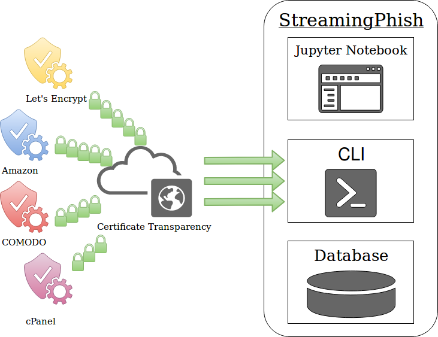

# StreamingPhish

This is a utility that uses supervised machine learning to detect phishing domains from the Certificate Transparency log network. The firehose of domain names and SSL certificates are made available thanks to the certstream network (certstream.calidog.io). All of the data required for training the initial predictive model is included in this project as well.

Also included is a Jupyter notebook to help explain each step of the supervised machine learning lifecycle (as it pertains to this project).

## Overview

This application consists of three main components:

- Jupyter notebook
  - Demonstrates how to train a phishing classifier from start to finish.
- CLI utility
  - Trains classifiers and evaluates domains in manual mode or against the Certificate Transparency log network (via certstream).
- Database
  - Stores trained classifiers, performance metrics, and code for feature extraction.

Each segment has been functionally decomposed into its own Docker container. The application is designed to be built and operated via Docker Compose.

## Install and Operational Instructions

- [Setup and Install](https://github.com/wesleyraptor/streamingphish/wiki/Setup-and-Install)
  - [Prerequisites](https://github.com/wesleyraptor/streamingphish/wiki/Setup-and-Install#prerequisites)
  - [Installation](https://github.com/wesleyraptor/streamingphish/wiki/Setup-and-Install#installation)
    - [Linux](https://github.com/wesleyraptor/streamingphish/wiki/Setup-and-Install#linux)
    - [Windows or Mac OSX](https://github.com/wesleyraptor/streamingphish/wiki/Setup-and-Install#windows-or-mac-osx)
- [Jupyter Notebook](https://github.com/wesleyraptor/streamingphish/wiki/Jupyter-Notebook)
- [CLI Utility](https://github.com/wesleyraptor/streamingphish/wiki/CLI-Utility)
  - [Running against CertStream](https://github.com/wesleyraptor/streamingphish/wiki/CLI-Utility#running-against-certstream)
  - [Running in Manual Mode](https://github.com/wesleyraptor/streamingphish/wiki/CLI-Utility#running-in-manual-mode)
  - [Classifier Management](https://github.com/wesleyraptor/streamingphish/wiki/CLI-Utility#classifier-management)
    - [Accuracy Metrics - All Trained Classifiers](https://github.com/wesleyraptor/streamingphish/wiki/CLI-Utility#accuracy-metrics---all-trained-classifiers)
    - [Accuracy Metrics - Single Classifier](https://github.com/wesleyraptor/streamingphish/wiki/CLI-Utility#accuracy-metrics---single-classifier)
    - [Changing the Active Classifier](https://github.com/wesleyraptor/streamingphish/wiki/CLI-Utility#changing-the-active-classifier)
    - [Deleting a Classifier](https://github.com/wesleyraptor/streamingphish/wiki/CLI-Utility#deleting-a-classifier)
  - [Training a Classifier](https://github.com/wesleyraptor/streamingphish/wiki/CLI-Utility#training-a-classifier)
    - [Retraining a Classifier](https://github.com/wesleyraptor/streamingphish/wiki/CLI-Utility#retraining-a-classifier)
      - [Keyword and Training Data Changes](https://github.com/wesleyraptor/streamingphish/wiki/CLI-Utility#keyword-and-training-data-changes)
      - [Feature Extraction Changes](https://github.com/wesleyraptor/streamingphish/wiki/CLI-Utility#feature-extraction-changes)
- [General Implementation Information](https://github.com/wesleyraptor/streamingphish/wiki/Home/#general-implementation-information)
  - [Checking Container State](https://github.com/wesleyraptor/streamingphish/wiki/Home/#checking-container-state)
  - [Stopping Containers](https://github.com/wesleyraptor/streamingphish/wiki/Home/#stopping-containers)
  - [Configuration](https://github.com/wesleyraptor/streamingphish/wiki/Home/#configuration)
  - [Training Data](https://github.com/wesleyraptor/streamingphish/wiki/Home/#training-data)
  - [Phishing Predictions from CertStream](https://github.com/wesleyraptor/streamingphish/wiki/Home/#phishing-predictions-from-certstream)

## Components

* [Docker](https://docs.docker.com/install/) - Containers that run the application.
* [Docker Compose](https://docs.docker.com/compose/install/) - Fabric for orchestrating containers and their respective services.
* [Python3](https://www.python.org/downloads/) - Programming language.
* [Scikit-learn](http://scikit-learn.org/stable/) - Open source library for training classifiers using Python. 

## Author

* **Wes Connell**

## License

This project is licensed under the Apache 2.0 License - see the [LICENSE](LICENSE) file for further details.

## Resources/Acknowledgments

* [Certificate Transparency Log Network](https://www.certificate-transparency.org/what-is-ct) - Framework that aggregates and streams SSL certificates issued by authorities in near real-time.
* [x0rz Phishing Catcher](https://github.com/x0rz/phishing_catcher/) - Phishing detection utility I saw that inspired me to build this project.
* [Calidog Security](https://github.com/CaliDog/certstream-python) - Calidog Security, creators of the certstream library.
* [Phishing Regex Resource](https://github.com/SwiftOnSecurity/PhishingRegex/blob/master/PhishingRegex.txt) - Cherry-picked a few of the phishing words from this list, authored by [SwiftOnSecurity](https://twitter.com/SwiftOnSecurity).
* [PhishTank](https://www.phishtank.com/) - Helped with identifying brands frequently targeted in phishing attacks.
